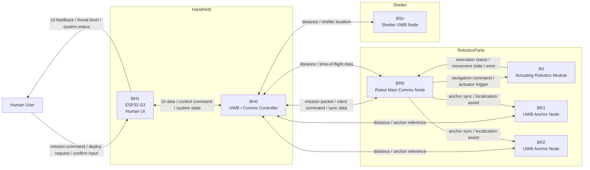

Jaesun Project

- HandHeld [BH0, BH1]

BH0 : Makerfabs ESP32 UWB DW3000
- > Connect with BH1 via UART over TTL
- > Connect with BR0 via ESP-NOW over WiFi
- > Connect with BS0 via UWB by DW3000
- > Connect with BR via UWB by DW3000

BH1 : Sunton ESP32-S3 [ESP32-8048S070]
프로젝트 설정 참고 : 
https://www.espboards.dev/esp32/cyd-esp32-8048s070
- > Connect with BH0 via UART over TTL
- > Human UI

BR0 : Makerfabs ESP32 UWB DW3000
- > Connect with BRn via UART over TTL
- > Connect with BH0 via ESP-NOW over WiFi
- > Connect with BH0 via UWB by DW3000
- > Connect with R0 via UART over TTL

R0 Actuating Robotics Module Powered by VEX V5
- > Connect with BR0 via UART over RS485

BRn : Makerfabs ESP32 UWB DW3000
- > Connect with BH0 via UWB by DW3000

BS0 : Makerfabs ESP32 UWB DW3000
- > Connect with BH0 via UWB by DW3000

Address info
ESP32 	Mac Address		UWB ID
BR0 : 		20:43:A8:42:0C:C8		0x100
BR1 : 		C0:5D:89:E9:1C:30		0x101
BR2 : 		20:43:A8:42:0C:CC		0x102
BH0 : 		20:43:A8:42:10:EC		0x200
BH1 :	 	3C:84:27:FC:D8:94		N/A
BS0 : 		C0:5D:89:E9:1C:44		0x300

Ports info
ESP32		RX		TX
BH0		16		17
BH1			

